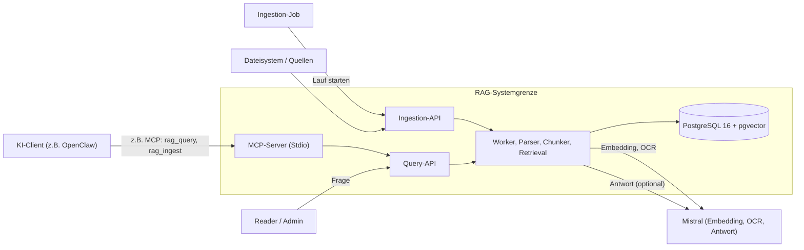
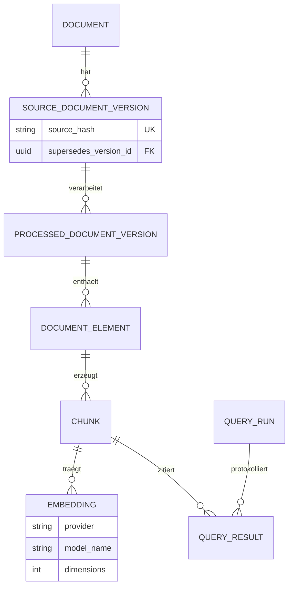
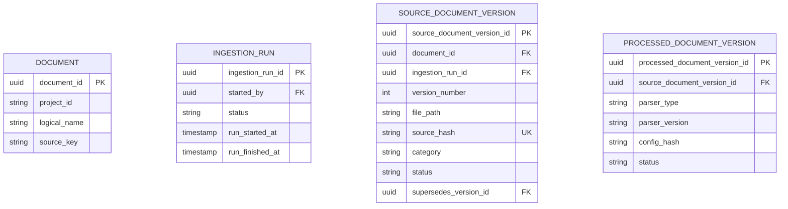
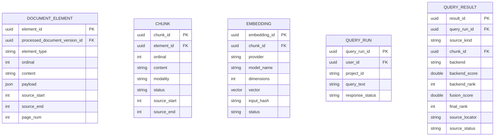

> **Hinweis:**
KI hat bei der Formatierung und sprachlichen Überarbeitung unterstützt.
Die fachlichen Inhalte und die Ausarbeitung wurden selbst erarbeitet.

# Strukturierte Quellenaufbereitung und Vektorspeicherung für ein Retrieval-Augmented Generation (RAG) System via Model Context Protocol (MCP)
## Projektarbeit mit Vorlesungsskripten als Beispieldaten

**Technisches Konzept für einen Prototype**

Strukturierte Quellenaufbereitung | Vektorspeicherung mit PostgreSQL und pgvector | MCP als Integrationsbeispiel

---

# 1. Was ist RAG?
## Retrieval-Augmented Generation

Ein Sprachmodell erzeugt seine Antwort nicht nur aus dem Trainingswissen. Vor der Antwort werden passende Textstellen aus einer Datenquelle gesucht und als Kontext übergeben.

```text
Frage
   |
Suche in freigegebenen Quellen
   |
Passende Textstellen
   |
RAG-LLM erzeugt Antwort
```

- Das RAG-System speichert und durchsucht freigegebene Wissensquellen.
- Das RAG-LLM verarbeitet die gefundenen Textstellen.
- Das Modell kann grundsätzlich ausgetauscht werden.
- Auf der RAG-Seite wird dafür ein Embedding-Modell benötigt.

### Warum RAG?

- Domänenspezifische Inhalte können verwendet werden, z. B. Vorlesungsskripte.
- Neue oder aktualisierte Quellen können nachträglich eingelesen werden.
- Antworten können mit den verwendeten Quellen verbunden werden.

### Verschiedene RAG-Ansätze

Es gibt verschiedene RAG-Ansätze. Sie unterscheiden sich unter anderem bei der Aufteilung der Dokumente, der Suche und der Verarbeitung der gefundenen Textstellen.

- Einfache RAG-Systeme verwenden eine einzelne semantische Suche.
- Hybride RAG-Systeme kombinieren semantische und lexikalische Suche.
- Erweiterte RAG-Systeme können zusätzliche Schritte zur Prüfung oder Auswahl der Ergebnisse verwenden.

Der Prototype verwendet eine hybride Suche.


---

# 2. Der Problemraum
## Warum ein LLM den Kontext verlieren kann

### Technische Grenzen großer Sprachmodelle

- **„Large“ bedeutet Breite:** LLMs verfügen über sehr viele Parameter und wurden mit einer großen Vielfalt an Trainingsdaten auf Allgemeinwissen optimiert.
- **Generalist statt Domänenspezialist:** Ein LLM kennt viele Themen, aber nicht automatisch die Nomenklatur, Definitionen und Struktur einer konkreten Organisation oder Domäne.
- **Fester Wissensstand:** Das Trainingswissen endet an einem bestimmten Zeitpunkt. Neue oder organisationsspezifische Informationen sind ohne externe Quellen nicht verfügbar.
- **Große Kontexte sind nicht automatisch gute Kontexte:** Ein vollständiger Dokumentbestand kann wichtige Details zwischen zu vielen Informationen verbergen.

**Konsequenz:** Für präzise Antworten braucht ein LLM gezielt ausgewählte, aktuelle und domänenspezifische Belege.

---

# 3. Der technische Lösungspfad
## Ablauf

```text
Freigegebene Quellen (Markdown, PDF, ...)
   |
Chunking: Abschnitte bis ca. 1200 Zeichen
   |
Embeddings und semantische Suche
   |
Lexikalische Suche: Begriffe und Formeln
   |
Kontext für das LLM
```

- **Chunking:** Der Text wird in Abschnitte von maximal etwa 1200 Zeichen geteilt. Die Trennung erfolgt bevorzugt an Satz- und Absatzgrenzen; jeder Chunk behält seine Position im Quelldokument.
- **Embeddings:** Ein SLM oder LLM wandelt Text und Suchanfrage in Vektoren um. Dadurch können inhaltlich ähnliche Textstellen gefunden werden.
- **Semantische Suche:** Die Vektoren werden verglichen. Die Suche berücksichtigt damit die Bedeutung einer Frage.
- **Lexikalische Suche:** Eine zusätzliche Suche findet exakte Fachbegriffe, Abkürzungen und Formeln.
- **Hybride Suche:** Die Ergebnisse beider Suchen werden zusammengeführt. Das LLM erhält dadurch mit wenigen Suchschritten den passenden Kontext.
- **Modelle:** Antwortmodell, OCR und Embeddings sind austauschbar. Im MVP werden dafür Mistral-APIs verwendet. Bei Anforderungen an den Datenschutz kann ein Modell mit Hosting in Europa gewählt werden.

**Ergebnis:** Das LLM erhält einen kleinen und passenden Kontext.

---

# 4. OCR und Textaufbereitung
## Verarbeitung heterogener Wissensquellen

- Quellen können Text, Bilder, Tabellen, Formeln und gescannte Seiten enthalten.
- OCR erkennt Text in Bildern und gescannten PDF-Seiten.
- Die erkannten Inhalte werden als strukturierter Text gespeichert.

Gespeichert werden zusätzlich:

- Seiten- oder Abschnittsnummer
- Kapitel und Überschrift
- Dateipfad
- Position im Quelldokument

**Verarbeitung:** OCR und/oder Parser -> strukturierte Elemente -> Chunks, Embeddings und Suchindex -> LLM-Kontext.

Im MVP: OCR, Embeddings und Antworten laufen über Mistral-APIs.

---

# 5. Anwendungsfelder des Gesamtsystems
## Vorlesungen als Beispiel

Dieselbe RAG-Basis kann unterschiedliche freigegebene Wissensbestände erschließen:

- Vorlesungsskripte, Folien und Modulhandbücher
- technische Dokumentation, Projektunterlagen und Richtlinien
- Forschungs- und Verwaltungsdokumente
- Lern- und Laboranwendungen mit Quellenpflicht

Der Bestand wird über `project_id`, Rollen und Versionen getrennt. Eine Anwendung kann über HTTP, CLI oder einen MCP-Client zugreifen. MCP ist dabei ein konkretes Integrationsbeispiel; der fachliche Use Case bleibt der Zugriff auf geprüftes Wissen.

---

# 6. Tokenreduktion und Nachhaltigkeit
## Warum sich zentrale Aufbereitung auszahlt

- Beim Ingestieren werden aus unstrukturierten Quellen einmalig strukturierte, durchsuchbare Daten erzeugt: Elemente, Chunks, Metadaten und Vektoren.
- Statt kompletter Unterlagen würde nur der passende Ausschnitt (Top-K-Chunks) an das Modell übergeben.
- Die Aufbereitung würde nicht bei jeder Anfrage wiederholt: weniger Tokens, geringere Kosten, weniger Energieverbrauch.
- Die Umwelt würde geschont, da jede Quelle nur einmal in strukturierte Daten aufbereitet werden muss.
- Anwender ohne eigenen/bezahlten KI-Dienst wären weniger benachteiligt: alle erhielten denselben zentralen Service.
- Der Umgang mit KI würde besser gelehrt: Antworten beruhen auf geprüften Quellen und tragen Quellenangaben.

---

# 7. Systemgrenze und Systemkontext
## Was zum RAG-System gehört




---

# 8. Akteure und Rollen
## Wer verfolgt welches Ziel

| Akteur | Rolle im Prototype | Ziel im System |
|---|---|---|
| Anwender / `Reader` | fachlicher Akteur | Wissen suchen und Quellen lesen |
| Admin / Wissens-Kurator | fachlicher Akteur | Quellen freigeben, Läufe starten, Versionen verwalten |
| Ingestion-/Wartungsjob | technischer Akteur | autorisierte Verarbeitung automatisiert ausführen |
| KI-Client (z. B. OpenClaw, Codex, VS Code) | externer Akteur | RAG-Funktionen über HTTP oder z. B. MCP aufrufen |
| Dateisystem, Datenbank, Modell- und OCR-Dienste | externe Systeme | Quellen, Persistenz und Modellfunktionen bereitstellen |

- Beispiele für angebundene Wissensbestände sind Semestertermine, Modulhandbücher oder Software-Engineering-Standards.

---

# 9. Use Cases des Gesamtsystems
## Fachliche Ziele und technische Integrationen

| Use Case | Ziel / Ergebnis | Primärer Akteur | Status |
|---|---|---|---|
| UC-01 | Quellen aufnehmen, strukturieren und versionieren | Admin / Ingestion-Job | MVP |
| UC-02 | Relevantes Wissen suchen und Treffer ermitteln | Reader / KI-Client | MVP |
| UC-03 | Suchergebnisse mit Quellenreferenzen zurückgeben | Reader / KI-Client | Erweiterung |
| UC-04 | Quellenbasierte Antwort aus dem Suchkontext erzeugen | Reader / KI-Client | MVP |
| UC-05 | RAG-Funktionen für externe Clients bereitstellen; MCP ist ein Beispiel für diesen Zugriff | KI-Client | MVP |
| UC-06 | Wissensbestände, Rollen und Freigaben verwalten | Admin / Wissens-Kurator | Erweiterung |
| UC-07 | Eine Domänenanwendung auf dem RAG aufbauen, z. B. Lernassistent oder Dokumentationssuche | Fachanwendung | Erweiterung |

UC-01, UC-02, UC-04 und UC-05 bilden den technischen MVP. UC-03, UC-06 und UC-07 zeigen Erweiterungen des Gesamtsystems und sind nicht auf Vorlesungen beschränkt.

Jeder Meilenstein ist mindestens einem Use Case zugeordnet. Querschnittsmeilensteine unterstützen mehrere Use Cases und werden entsprechend mehrfach zugeordnet.

---

# 10. Gesamt-Workflow
## Ablauf und Systemschichten

```text
Freigegebene Quelle
   |
OCR oder Markdown-Parser
   |
Chunking und Suchindex
   |
Semantische und lexikalische Suche
   |
RRF-Fusion
   |
Fachanwendung oder KI-Client
```

### Systemschichten

`KI-Client` -> `MCP-Server (Stdio, Beispiel)` -> `RAG-HTTP-API` -> `PostgreSQL + pgvector`

Das RAG-System liefert relevante Textstellen; Quellenreferenzen können als Erweiterung mit zurückgegeben werden. Eine Fachanwendung oder ein KI-Client verwendet die Textstellen für die jeweilige Domäne, zum Beispiel für Dialog, Dokumentationssuche oder Aufgaben.

**Randnotiz:** OpenClaw steht hier als Beispiel für einen KI-Client. Der Prototype trennt den fachlichen Use Case vom Zugriffsweg; neben HTTP kann beispielsweise MCP verwendet werden.

### Vereinfachter Ablauf einer Anfrage

```text
1. KI-Client: Frage
   |
   v
2. RAG-LLM: Suchanfrage
   |
   v
3. Zugriffsadapter, z. B. MCP: Tool-Aufruf
   |
   v
4. Datenbank: relevante Top-K-Chunks
   |                 |
   +-- Chunks -------+--> RAG-LLM: Frage + Chunks
                              |
                              v
                    Antwort; Quellen optional
                              |
                              v
                         KI-Client
```

Der KI-Client nimmt die Frage entgegen und gibt sie an das RAG-LLM weiter. Das RAG-LLM fordert über einen verfügbaren Zugriffsweg, zum Beispiel den MCP-Prototyp, passende Textstellen an. Die Datenbank liefert relevante Top-K-Chunks; Quellenreferenzen werden als Erweiterung ergänzt. Daraus erzeugt das RAG-LLM die Antwort und gibt sie an den Client zurück.

---

# 11. Schnittstellen
## APIs, Ports und Protokolle

| Schnittstelle | Richtung | Vertrag |
|---|---|---|
| Ingestion-API | `Admin`/Job -> RAG | `POST /v1/ingestions`: Request -> Lauf, Chunks, Embeddings |
| Query-API | Client -> RAG (lesend) | `POST /v1/queries`: Frage -> Top-K-Chunks mit Score, Rang und optionalem Quellen-Locator |
| Health | Client -> RAG (lesend) | `GET /health`: Erreichbarkeit |
| MCP über Stdio | KI-Client -> RAG | JSON-RPC-Tools `rag_ingest`, `rag_query`, `rag_health` |
| Embedding-Port | RAG -> Mistral | HTTP-Endpunkt, `mistral-embed`, 1024 Dimensionen |
| Antwort-Port | RAG -> Mistral | OpenAI-kompatibler Endpunkt, Mistral-Chat-Modell |

- Interne Ports (`DocumentKnowledgePort`, `RetrievalPort`) kapseln die Module.
- Kein Modul greift direkt auf den Store eines anderen Moduls zu.

---

# 12. Ingestion und Retrieval
## Datenaufnahme und Suche

### Markdown- und Text-Chunking

- Beim Ingestieren werden aus unstrukturierten Quellen strukturierte, durchsuchbare Daten erzeugt.
- Der Text wird in Abschnitte von maximal etwa 1200 Zeichen geteilt; die Trennung erfolgt an Satz- und Absatzgrenzen.
- Überschriften werden als Metadaten übernommen.
- Jeder Chunk trägt Seiten- bzw. Abschnittsangabe, Kapitelpfad und Quelle.
- Formeln und Fachbegriffe bleiben im passenden Textabschnitt.

### Suche

- **Semantisch:** Embeddings werden in pgvector gespeichert und über HNSW gesucht.
- **Lexikalisch:** PostgreSQL-Volltextsuche (`to_tsvector`, `ts_rank_cd`) findet exakte Begriffe.
- **Kombination:** Reciprocal Rank Fusion (RRF) führt beide Ergebnislisten zusammen.
- **Modi:** `hybrid`, `semantic`, `lexical`, `retrieval-only`.

$$RRF(d) = \sum_{m \in M} \frac{1}{k + rank_m(d)}, \quad k=60$$

---

# 13. Datenmodell (reduziert)
## Quellelement zum Embedding



- `source_hash` macht die Ingestion idempotent: identische Inhalte werden erkannt und nicht unnötig doppelt verarbeitet.
- Neue Versionen überschreiben alte nicht; `supersedes_version_id` hält die Versionskette nachvollziehbar.
- Abfragen werden in `query_runs` und `query_results` mit Score, Rang und Quelle protokolliert.

---

# 14. Datenmodell: Entitäten der Ingestion
## Von der Quelle zur verarbeiteten Version



| Entität | Bedeutung |
|---|---|
| `DOCUMENT` | Ein logisches Dokument je Domäne (Projektkennung) und Quelle, identifiziert über `source_key`. |
| `INGESTION_RUN` | Ein Ingestion-Lauf mit Status (`NEW`, `RUNNING`, `COMPLETED`, `FAILED`, ...) und Zeitstempeln. |
| `SOURCE_DOCUMENT_VERSION` | Unveränderliche Version einer Quelle: Hash, Dateipfad, Kategorie, Status und Vorgänger-Version. |
| `PROCESSED_DOCUMENT_VERSION` | Verarbeitungsergebnis: welcher Parser in welcher Version und Konfiguration gelaufen ist. |

### Warum gibt es `DOCUMENT` und `SOURCE_DOCUMENT_VERSION`?

Die beiden Entitäten beschreiben unterschiedliche Ebenen:

- **`DOCUMENT`** ist die logische Identität eines Dokuments. Beispiel: „Modulhandbuch Informatik“.
- **`SOURCE_DOCUMENT_VERSION`** ist eine konkrete, unveränderliche Fassung dieses Dokuments. Sie enthält beispielsweise den Dateipfad, den Inhaltshash und die Versionsnummer.
- **`PROCESSED_DOCUMENT_VERSION`** beschreibt zusätzlich, wie diese Fassung verarbeitet wurde: mit welchem Parser, welcher Parser-Version und welcher Konfiguration.

Beispiel für zwei Fassungen desselben logischen Dokuments:

```text
DOCUMENT
  source_key = "modulhandbuch-informatik"
  logical_name = "Modulhandbuch Informatik"
  |
  +-- Version 1: PDF, source_hash = A
  +-- Version 2: PDF, source_hash = B
```

Die Trennung ist sinnvoll, wenn alte Fassungen erhalten bleiben sollen. Dadurch bleibt nachvollziehbar, aus welcher Dokumentversion ein Chunk oder eine Quellenangabe stammt. Eine neue Fassung überschreibt die alte nicht, sondern wird über `supersedes_version_id` verknüpft.

### Die drei Kennungen

| Kennung | Bedeutung |
|---|---|
| `document_id` | Interne Datenbank-ID des logischen Dokuments |
| `source_key` | Stabile fachliche Kennung, die von außen zur Identifikation verwendet wird |
| `source_hash` | Prüfsumme des konkreten Inhalts einer importierten Fassung |

`source_key` beantwortet die Frage **„Welches logische Dokument ist gemeint?“**. `source_hash` beantwortet dagegen **„Welche konkrete Inhaltsfassung wurde importiert?“**. Der Dateiname oder Dateipfad kann sich ändern, ohne dass dadurch ein neues logisches Dokument entsteht.

Wenn keine Versionshistorie und keine reproduzierbaren Quellenangaben benötigt werden, könnten `DOCUMENT` und `SOURCE_DOCUMENT_VERSION` für einen einfachen Prototypen auch zusammengelegt werden. Die getrennte Modellierung unterstützt hier jedoch die Nachvollziehbarkeit der Quellen.

---

# 15. Datenmodell: Inhalte und Suche
## Vom Element über den Chunk zum Treffer



| Entität | Bedeutung |
|---|---|
| `DOCUMENT_ELEMENT` | Strukturierte Elemente je verarbeiteter Version: `TEXT`, `HEADING`, `TABLE`, `IMAGE`, `FORMULA`, `TOC`; mit Reihenfolge (`ordinal`), Seitennummer und Position im Quelldokument. |
| `CHUNK` | Suchbarer Abschnitt je Element mit eigener Reihenfolge (`ordinal`), Inhaltsart (`modality`) und Status. |
| `EMBEDDING` | Vektor je Chunk in pgvector: Provider, Modell, Dimensionen, Input-Hash und Status. |
| `QUERY_RUN` | Protokollierte Anfrage mit Antwortstatus, z. B. `ANSWERED`, `NOT_ANSWERABLE`, `CONFLICTING_EVIDENCE`. |
| `QUERY_RESULT` | Ein einzelner Treffer: Backend, Score, Rang nach Fusion und Quellen-Locator. |

### `ordinal`: Reihenfolge im Quelldokument

`ordinal` ist eine laufende Nummer innerhalb des jeweiligen Elternobjekts. Sie beschreibt die ursprüngliche Reihenfolge und nicht die Relevanz eines Suchtreffers:

- Bei `DOCUMENT_ELEMENT` steht `ordinal = 1` beispielsweise für die erste erkannte Überschrift oder das erste Textelement.
- Bei `CHUNK` gibt `ordinal` die Reihenfolge der Chunks innerhalb desselben Elements an, wenn ein Element in mehrere Abschnitte geteilt wurde.
- Die Suchreihenfolge wird dagegen über `backend_rank` oder `final_rank` in `QUERY_RESULT` beschrieben.

Zusammen mit `source_start`, `source_end` und `page_num` kann das System die Position eines Inhalts im ursprünglichen Dokument nachvollziehen.

### `modality`: Inhaltsart eines Chunks

`modality` beschreibt, in welcher Form der Inhalt eines Chunks vorliegt oder verarbeitet wird. Der Begriff ist besonders bei Quellen mit unterschiedlichen Medien wichtig:

| Wert | Bedeutung |
|---|---|
| `PROSE_TEXT` | normaler Fließtext oder Absatz |
| `STRUCTURED_TABLE` | Tabelle oder sonstige strukturierte Daten |
| `VISUAL_DOC` | Bild, Scan oder visuell interpretierter Dokumentbereich |

`element_type` beschreibt dabei die erkannte Struktur des Quelldokuments, zum Beispiel `HEADING`, `TABLE` oder `IMAGE`. `modality` beschreibt dagegen die Inhaltsform des daraus erzeugten, suchbaren Chunks. `modality` ist also keine Modellart und auch kein Suchrang.

---

# 16. Beispielanwendung: Lernassistent
## Eine mögliche Domänenanwendung

In einer möglichen Lernanwendung verarbeitet ein KI-Client die gefundenen Textstellen und führt einen Dialog mit dem Studierenden:

- Inhalte werden in einzelnen Abschnitten erklärt.
- Zwischenfragen prüfen das Verständnis.
- Antworten können auf die verwendeten Chunks verweisen.
- Der Dialog kann an den bisherigen Lernstand angepasst werden.

### Antwortgrundlage

Antworten sollen nur aus dem abgerufenen Kontext erzeugt werden. Die Erweiterung UC-03 ergänzt Quellenreferenzen; ohne ausreichenden Kontext antwortet der Generator nicht.

---

# 17. Beispielanwendung: Aufgaben und Anki
## Optionaler Aufsatz auf UC-07

Aus den abgerufenen Textstellen können erzeugt werden:

- Multiple-Choice-Fragen.
- Freitextaufgaben.
- Frage-Antwort-Karten für Anki.

### Anki-Artefakt

```text
Frage;Antwort;Quelle
"Was bedeutet ...?";"Definition ...";"Kapitel 3 / Skript S. 42"
```

Das RAG-System liefert die Textstellen. Die Fachanwendung erzeugt daraus Aufgaben und Karten.

**MVP-Grenze:** Aufgabengenerierung und Anki-Export sind Erweiterungen auf Basis der erzeugten Chunks.

---

# 18. Integrationsbeispiel: MCP-Prototyp
## Tools für Datenaufnahme, Suche und Systemstatus

### Model Context Protocol über Stdio

Der MCP-Server ist ein Beispiel für einen Adapter zwischen KI-Client und RAG-System. Er transportiert die Use Cases, ersetzt sie aber nicht.

| Tool | Eingabe | Ergebnis |
|---|---|---|
| `rag_ingest` | `source_path`, `project_id` | Indexierte Chunks der Quelle |
| `rag_query` | `query_text`, `retrieval_mode`, `result_limit` | Top-K-Chunks, optional mit Quellenreferenzen |
| `rag_health` | – | Erreichbarkeit von RAG-API und Embedding-Endpunkt |

### Technische Angaben

- Validierung über typisierte Dataclasses.
- Transportneutrale Fehlerklassen: `AuthorizationError`, `SourceValidationError`, `DependencyUnavailableError`, `CitationValidationError`.
- **Implementierung:** Die Komponenten werden primär in **Python** (API, Server, Ingestion) und **Rust** (Performance-kritische Teile wie Chunking/Embedding-Pipeline) umgesetzt.
- Persistenz in PostgreSQL 16: `source_document_versions`, `chunks`, `embeddings`.
- Der MCP-Server verbindet die Tools über eine HTTP-API mit der gemeinsamen Datenbank.
- Die Inhalte werden über eine Projekt- oder Domänenkennung getrennt.
- Der Zugriff wird über Projektkennungen und Rollen geregelt; domänenspezifische Passwörter sind als Erweiterung vorgesehen.

---

# 19. Meilensteine und Traceability
## Jeder Meilenstein liefert ein Inkrement für mindestens einen Use Case

Jeder Meilenstein baut auf dem vorherigen auf, endet mit einem lauffähigen Zwischenstand und ist fachlich einem Use Case zugeordnet. Grundlagen-Meilensteine unterstützen mehrere Use Cases.

| Meilenstein | Use Case | Inhalt | Ergebnis |
|---|---|---|---|
| M1 | UC-01, UC-02, UC-04 | Technische Basis: PostgreSQL 16 + pgvector, Schema, lokale Umgebung und Health-Prüfung | Persistenz ist erreichbar und für die ersten Use Cases nutzbar |
| M2 | UC-01 | Parser, Chunking (max. ca. 1200 Zeichen), Idempotenz per Hash | Quellen liegen als versionierte Chunks mit Herkunft vor |
| M3 | UC-02 | `mistral-embed` anbinden, Vektoren speichern, HNSW-Index | Semantische Suche ist möglich |
| M4 | UC-02 | Volltextsuche, RRF-Fusion und Suchmodi | Top-K-Chunks mit Score und Rang |
| M5 | UC-04 | Antwortgenerator mit Kontextpflicht | Antwort nur aus dem Suchkontext, mit Status |
| M6 | UC-01, UC-02, UC-04 | HTTP-API für Ingestion, Query und Health | Der RAG ist über HTTP nutzbar |
| M7 | UC-05 | MCP-Server über Stdio: `rag_ingest`, `rag_query`, `rag_health` | Ein KI-Client kann die Use Cases über MCP aufrufen |
| M8 | UC-03, UC-04, UC-05 | KI-Client anbinden, Quellenreferenzen optional zurückgeben und Quellenpflicht je Aussage umsetzen | End-to-End: Frage -> Antwort |
| M9 | UC-07 | Optionale Lernfunktionen: Aufgabengenerierung und Anki-Export | Eine Fachanwendung nutzt die erzeugten Chunks |
| M10 | UC-01 | OCR-Pipeline für PDFs, Bilder und gescannte Quellen | Auch heterogene Quellen werden durchsuchbar |
| M11 | UC-06 | Zugriffsschutz: Rollen, Domänen und Freigaben | Absicherung für den organisationsweiten Betrieb |

- Nach jedem Meilenstein liegt ein lauffähiger Zwischenstand vor; es kann jederzeit an einem Ergebnis gestoppt werden.


---

# 20. Mögliche Erweiterung
## Persönlicher Wissensgraph

Ein persönlicher Wissensgraph ist nicht Teil des Prototypen. Er kann bei ausreichender Zeit und verfügbaren Ressourcen als Erweiterung untersucht werden.

- Für jeden Studierenden wird gespeichert, welche Teile der Unterlagen bearbeitet wurden.
- Der Graph kann festhalten, welche Zusammenhänge der Studierende verstanden und selbst erklärt hat.
- Ein KI-Client kann den Lernprozess über eine Memory-Funktion begleiten.
- Im sokratischen Dialog benennt der Studierende Beziehungen zwischen Konzepten.
- Ein KI-Client kann daraus eine Graphstruktur erzeugen oder den dafür benötigten Code erstellen.
- Bei späteren Gesprächen kann der Graph erneut abgefragt werden, um den Lernstand einzuschätzen.
- Das RAG-System liefert weiterhin die fachlichen Informationen zu den Themen.
- Mögliche Technologien sind Memgraph oder Neo4j mit Cypher.

### Forschungsfrage

**Wie kann ein persönlicher Wissensgraph den Lernstand eines Studierenden aus Dialogen und freigegebenen Lernquellen abbilden?**

---

# Fazit
## Strukturierte Quellenaufbereitung und RAG-Zugriff

**Strukturierte Quellenaufbereitung:** Freigegebene Quellen werden idempotent in Elemente, Chunks und Metadaten mit vollständiger Lineage zerlegt.

**Vektorspeicherung:** Embeddings liegen in PostgreSQL 16 + pgvector (HNSW); semantische, lexikalische und hybride Suche (RRF) liefern Top-K-Chunks. Quellenreferenzen sind als Erweiterung vorgesehen.

**MCP:** Der MCP-Server stellt die Tools `rag_ingest`, `rag_query` und `rag_health` bereit und verbindet jeden KI-Client mit dem RAG-System.

Vorlesungsskripte dienen als Beispieldaten. Lernassistent, Dokumentationssuche oder Verwaltungswissen sind mögliche Anwendungen auf derselben Basis.
