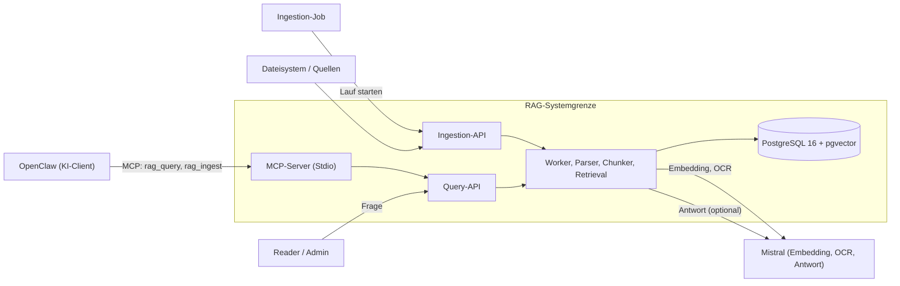
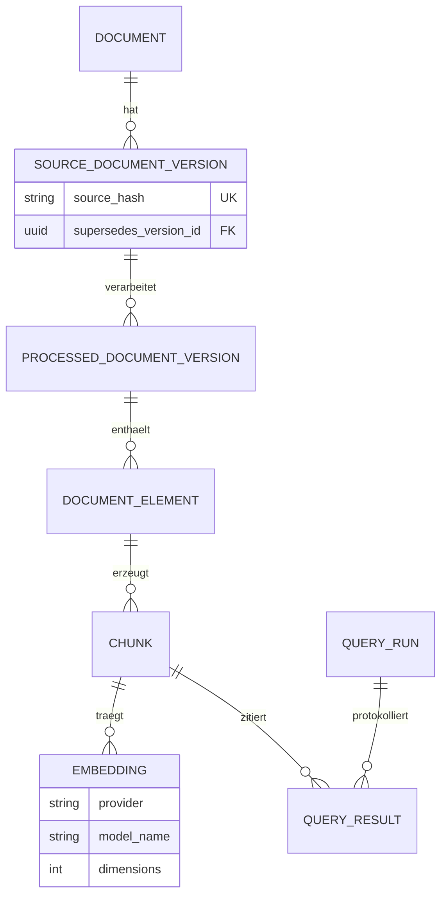
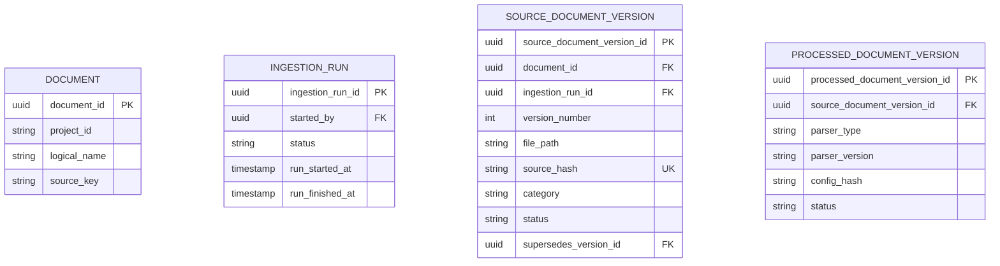
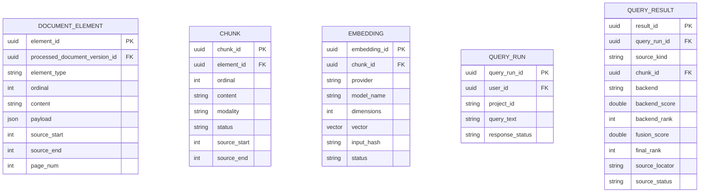

# RAG-Lernassistent
## Vom Vorlesungsskript zum aktiven Prüfungstraining

**Technisches Konzept für einen Prototype**

Markdown-Ingestion | Hybrides Retrieval | OpenClaw | Anki

---

# 1. Was ist RAG?
## Retrieval-Augmented Generation

Ein Sprachmodell erzeugt seine Antwort nicht nur aus dem Trainingswissen. Vor der Antwort werden passende Textstellen aus einer Datenquelle gesucht und als Kontext übergeben.

```text
Frage
   |
Suche in Vorlesungsdaten
   |
Passende Textstellen
   |
RAG-LLM erzeugt Antwort
```

- Das RAG-System speichert und durchsucht die Vorlesungsdaten.
- Das RAG-LLM verarbeitet die gefundenen Textstellen.
- Das Modell kann grundsätzlich ausgetauscht werden.
- Auf der RAG-Seite wird dafür ein Embedding-Modell benötigt.

### Warum RAG?

- Vorlesungsspezifische Inhalte können verwendet werden.
- Aktuelle freigegebene Materialien können nachträglich eingelesen werden.
- Antworten können mit Quellen aus den Vorlesungsfolien verbunden werden.

### Verschiedene RAG-Ansätze

Es gibt verschiedene RAG-Ansätze. Sie unterscheiden sich unter anderem bei der Aufteilung der Dokumente, der Suche und der Verarbeitung der gefundenen Textstellen.

- Einfache RAG-Systeme verwenden eine einzelne semantische Suche.
- Hybride RAG-Systeme kombinieren semantische und lexikalische Suche.
- Erweiterte RAG-Systeme können zusätzliche Schritte zur Prüfung oder Auswahl der Ergebnisse verwenden.

Der Prototype verwendet eine hybride Suche.

### Nutzen für das Lernen

- Studierende erhalten Erklärungen zu den verwendeten Unterlagen.
- Fragen können auf einzelne Kapitel oder Folien bezogen werden.
- Aufgaben und Lernkarten können aus den Vorlesungsdaten erzeugt werden.

---

# 2. Der Problemraum
## Warum ein LLM den Kontext verlieren kann

### Technische Grenzen großer Sprachmodelle

- **„Large“ bedeutet Breite:** LLMs verfügen über sehr viele Parameter und wurden mit einer großen Vielfalt an Trainingsdaten auf Allgemeinwissen optimiert.
- **Generalist statt Vorlesungsspezialist:** Ein LLM kennt viele Themen, aber nicht automatisch die Nomenklatur, Definitionen und Struktur genau dieser Hochschule oder dieses Kurses.
- **Fester Wissensstand:** Das Trainingswissen endet an einem bestimmten Zeitpunkt. Neue Forschung, Semesteränderungen und aktuelle Folien sind ohne externe Quellen nicht verfügbar.
- **Große Kontexte sind nicht automatisch gute Kontexte:** Ein komplettes Semester an Folien kann wichtige Details zwischen zu vielen Informationen verbergen.

**Konsequenz:** Für präzise Antworten braucht ein LLM gezielt ausgewählte, aktuelle und vorlesungsspezifische Belege.

---

# 3. Der technische Lösungspfad
## Ablauf

```text
Alle Materialien
   |
Chunking: Abschnitte bis ca. 1200 Zeichen
   |
Embeddings und semantische Suche
   |
Lexikalische Suche: Begriffe und Formeln
   |
Kontext für das LLM
```

- **Chunking:** Der Text wird in Abschnitte von maximal etwa 1200 Zeichen geteilt. Die Trennung erfolgt bevorzugt an Satz- und Absatzgrenzen; jeder Chunk behält seine Position im Quelldokument.
- **Embeddings:** Ein SLM oder LLM wandelt Text und Suchanfrage in Vektoren um. Dadurch können inhaltlich ähnliche Textstellen gefunden werden.
- **Semantische Suche:** Die Vektoren werden verglichen. Die Suche berücksichtigt damit die Bedeutung einer Frage.
- **Lexikalische Suche:** Eine zusätzliche Suche findet exakte Fachbegriffe, Abkürzungen und Formeln.
- **Hybride Suche:** Die Ergebnisse beider Suchen werden zusammengeführt. Das LLM erhält dadurch mit wenigen Suchschritten den passenden Kontext.
- **Modell:** Das Sprachmodell ist austauschbar. Im MVP stammen Antwortmodell, OCR und Embeddings von Mistral; die Schnittstellen bleiben dabei gleich und sind austauschbar. Bei Anforderungen an den Datenschutz kann ein Modell mit Hosting in Europa gewählt werden.

**Ergebnis:** Das LLM erhält einen kleinen und passenden Kontext.

---

# 4. OCR und Textaufbereitung
## Verarbeitung von Folien

- Folien können Text, Bilder, Tabellen, Formeln und Screenshots enthalten.
- OCR erkennt Text in Bildern und gescannten PDF-Seiten.
- Die erkannten Inhalte werden als strukturierter Text gespeichert.

Gespeichert werden zusätzlich:

- Foliennummer
- Kapitel und Überschrift
- Dateipfad
- Position im Quelldokument

**Verarbeitung:** OCR oder Markdown-Parser -> Textabschnitte -> Embeddings und Suchindex -> LLM-Kontext.

Im MVP: hybrider PDF-Extractor; OCR, Embeddings und Antworten laufen über Mistral-APIs.

---

# 5. Vorteile für die Hochschule

### Einheitliche Datenbasis

- Vorlesungsfolien könnten mit Überschriftenhierarchien, Alternativtexten und Metadaten erstellt werden.
- Die Hochschule könnte die geprüften Vorlesungsdaten zentral bereitstellen.
- Dozierende könnten festlegen, welche Inhalte für ein Fach freigegeben werden.

### Fachbezogener Zugriff über einen MCP-Prototyp

- Der Zugriff könnte über einen MCP-Prototyp (Model Context Protocol) erfolgen.
- Ein Server würde die MCP-Schnittstellen mit der gemeinsamen Datenbank verbinden.
- Die Datenbank bliebe gleich; die Inhalte würden nach Vorlesung und Fach getrennt.
- Alle Studierenden eines Fachs würden denselben geprüften Wissensstand erhalten.
- Zugriffe könnten über Projektkennungen und Rollen eingeschränkt werden; Passwörter je Fach wären als Erweiterung möglich.
- Quellen und verwendete Modelle könnten zentral kontrolliert werden.

### Einsatz in Laboren

- Studierende könnten in Laborveranstaltungen ein eigenes RAG-System aufbauen.
- Dabei würden sie praktische Aufgaben aus den Bereichen Datenbanken, Kommunikationsnetze und verteilte Systeme bearbeiten.
- Mögliche Bestandteile wären Datenaufbereitung, Chunking, Embeddings, Vektorsuche und MCP-Kommunikation.

Die Nutzung könnte als Angebot bereitgestellt werden. Professoren und Studierende müssten sie nicht verwenden.

---

# 6. Tokenreduktion und Nachhaltigkeit
## Warum sich zentrale Aufbereitung auszahlt

- Beim Ingestieren werden aus unstrukturierten Vorlesungsdaten einmalig strukturierte, durchsuchbare Daten erzeugt: Elemente, Chunks, Metadaten und Vektoren.
- Statt kompletter Unterlagen würde nur der passende Ausschnitt (Top-K-Chunks) an das Modell übergeben.
- Die Aufbereitung würde nicht bei jeder Anfrage wiederholt: weniger Tokens, geringere Kosten, weniger Energieverbrauch.
- Die Umwelt würde geschont, da die Vorlesungsdaten nur einmal in strukturierte Daten aufbereitet werden.
- Studierende ohne aktiven Zugang zu eigenen KI-Diensten wären weniger benachteiligt: alle erhielten denselben zentralen Service.
- Der Umgang mit KI würde besser gelehrt: Antworten beruhen auf geprüften Quellen und tragen Quellenangaben.

---

# 7. Systemgrenze und Systemkontext
## Was zum Prototype gehört und was nicht



- **Innerhalb:** Ingestion, Lineage, Speicherung, Retrieval, Kontext- und Zitationsprüfung, MCP-Server.
- **Außerhalb:** Nutzeroberfläche, Markdown-Quellen im Dateisystem, Mistral-API (Embedding, OCR, Antwort), Betriebsumgebung.
- **API-only-Regel:** Die Datenbank ist kein Integrationsweg; alle Zugriffe laufen über die Ingestion- und Query-API.

---

# 8. Akteure und Rollen
## Wer darf was

| Akteur | Rolle im Prototype | darf |
|---|---|---|
| Studierende | `Reader` | Fragen stellen, Treffer mit Quellen lesen |
| Dozierende / Projektleitung | `Admin` | Ingestion starten oder freigeben, Versionen verwalten |
| Ingestion-/Wartungsjob | technischer Akteur | autorisierte Läufe automatisiert ausführen |
| OpenClaw (KI-Client) | externer Client | lesender Wissenszugriff über MCP |
| Dateisystem, Datenbank, Mistral-Dienste | externe Systeme | Quellen, Persistenz, Vektoren, OCR und Antworten bereitstellen |

- Niemand ändert Chunks, Embeddings oder Versionen direkt; Schreibzugriffe laufen ausschließlich über die Ingestion-API.
- Eine projektbezogene Rollenzuordnung geht einer globalen Zuordnung vor.

---

# 9. Use Cases und MVP-Grenzen
## Was der Prototype abdecken soll

| Use Case | Inhalt | Akteur | Status im MVP |
|---|---|---|---|
| UC-01 | Multimodale Abfrage und Kontextfusion: hybride Suche, RRF-Fusion, quellenbelegte Treffer | RAG-Nutzer (`Reader`), später autorisierter KI-Client | Neubau: M3-M5 |
| UC-02 | Ingestion und Lineage: Markdown-Dokumente, idempotent und nachvollziehbar | `Admin` oder autorisierter Ingestion-Job | Neubau: M1-M2 |
| UC-03 | Wissenskuratierung und Qualitätsverwaltung | Wissens-Kurator (`Admin`) | vertagt, nicht Teil des MVP |
| UC-04 | Persönlicher Zettelkasten über Korrekturhinweise | externe Zettelkasten-Anwendung | entfällt im MVP (keine Correction-API) |

Nicht Teil des MVP: Aufgabengenerierung, Anki-Export, Passwörter je Fach und die Correction-API.

Der gesamte RAG wird neu und ohne KI-Unterstützung implementiert; die Reihenfolge steht in den Meilensteinen (Folie 19).

---

# 10. Gesamt-Workflow
## Ablauf und Systemschichten

```text
Markdown
   |
OCR oder Markdown-Parser
   |
Chunking und Suchindex
   |
Semantische und lexikalische Suche
   |
RRF-Fusion
   |
OpenClaw: Dialog, Aufgaben, Anki
```

### Systemschichten

`OpenClaw` -> `MCP-Server (Stdio)` -> `RAG-HTTP-API` -> `PostgreSQL + pgvector`

Das RAG-System liefert Textstellen mit Quellen. OpenClaw verwendet diese Textstellen für Dialog und Aufgaben.

**Randnotiz:** OpenClaw steht hier als Abstraktion für den KI-Client. Der Prototype spricht jeden OpenAI-kompatiblen Client an. Ein eigener Client (Hermes) wäre später denkbar, wäre für den MVP aber zu viel.

### Vereinfachter Ablauf einer Anfrage

```text
1. OpenClaw: Frage
   |
   v
2. RAG-LLM: Suchanfrage
   |
   v
3. MCP-Prototyp: Tool-Aufruf
   |
   v
4. Datenbank: relevante Top-K-Chunks
   |                 |
   +-- Chunks -------+--> RAG-LLM: Frage + Chunks
                              |
                              v
                    Antwort mit Quellen
                              |
                              v
                         OpenClaw
```

OpenClaw nimmt die Frage entgegen und gibt sie an das RAG-LLM weiter. Das RAG-LLM fordert über den MCP-Prototyp passende Textstellen an. Die Datenbank liefert nur relevante Top-K-Chunks mit Quellen. Diese Chunks werden an das RAG-LLM zurückgegeben. Das RAG-LLM erzeugt daraus die Antwort und gibt sie an OpenClaw zurück.

---

# 11. Schnittstellen
## APIs, Ports und Protokolle

| Schnittstelle | Richtung | Vertrag |
|---|---|---|
| Ingestion-API | `Admin`/Job -> RAG | `POST /v1/ingestions`: Request -> Lauf, Chunks, Embeddings |
| Query-API | Client -> RAG (lesend) | `POST /v1/queries`: Frage -> Top-K-Chunks mit Score, Rang und Quelle |
| Health | Client -> RAG (lesend) | `GET /health`: Erreichbarkeit |
| MCP über Stdio | KI-Client -> RAG | JSON-RPC-Tools `rag_ingest`, `rag_query`, `rag_health` |
| Embedding-Port | RAG -> Mistral | HTTP-Endpunkt, `mistral-embed`, 1024 Dimensionen |
| Antwort-Port | RAG -> Mistral | OpenAI-kompatibler Endpunkt, Mistral-Chat-Modell |

- Interne Ports (`DocumentKnowledgePort`, `RetrievalPort`) kapseln die Module.
- Kein Modul greift direkt auf den Store eines anderen Moduls zu.

---

# 12. Ingestion und Retrieval
## Datenaufnahme und Suche

### Markdown- und Text-Chunking

- Beim Ingestieren werden aus unstrukturierten Vorlesungsdaten strukturierte, durchsuchbare Daten erzeugt.
- Der Text wird in Abschnitte von maximal etwa 1200 Zeichen geteilt; die Trennung erfolgt an Satz- und Absatzgrenzen.
- Überschriften werden als Metadaten übernommen.
- Jeder Chunk trägt Foliennummer, Kapitelpfad und Quelle.
- Formeln und Fachbegriffe bleiben im passenden Textabschnitt.

### Suche

- **Semantisch:** Embeddings werden in pgvector gespeichert und über HNSW gesucht.
- **Lexikalisch:** PostgreSQL-Volltextsuche (`to_tsvector`, `ts_rank_cd`) findet exakte Begriffe.
- **Kombination:** Reciprocal Rank Fusion (RRF) führt beide Ergebnislisten zusammen.
- **Modi:** `hybrid`, `semantic`, `lexical`, `retrieval-only`.

$$RRF(d) = \sum_{m \in M} \frac{1}{k + rank_m(d)}, \quad k=60$$

---

# 13. Datenmodell (reduziert)
## Lineage vom Quellelement zum Embedding



- `source_hash` macht die Ingestion idempotent: gleiche Inhalte werden nicht doppelt verarbeitet.
- Neue Versionen überschreiben alte nicht; `supersedes_version_id` hält die Versionskette nachvollziehbar.
- Abfragen werden in `query_runs` und `query_results` mit Score, Rang und Quelle protokolliert.

---

# 14. Datenmodell: Entitäten der Ingestion
## Von der Quelle zur verarbeiteten Version



| Entität | Bedeutung |
|---|---|
| `DOCUMENT` | Ein logisches Dokument je Fach (Projektkennung) und Quelle, identifiziert über `source_key`. |
| `INGESTION_RUN` | Ein Ingestion-Lauf mit Status (`NEW`, `RUNNING`, `COMPLETED`, `FAILED`, ...) und Zeitstempeln. |
| `SOURCE_DOCUMENT_VERSION` | Unveränderliche Version einer Quelle: Hash, Dateipfad, Kategorie, Status und Vorgänger-Version. |
| `PROCESSED_DOCUMENT_VERSION` | Verarbeitungsergebnis: welcher Parser in welcher Version und Konfiguration gelaufen ist. |

---

# 15. Datenmodell: Inhalte und Suche
## Vom Element über den Chunk zum Treffer



| Entität | Bedeutung |
|---|---|
| `DOCUMENT_ELEMENT` | Strukturierte Elemente je verarbeiteter Version: `TEXT`, `HEADING`, `TABLE`, `IMAGE`, `FORMULA`, `TOC`; mit Ordinalzahl, Seitennummer und Position im Quelldokument. |
| `CHUNK` | Suchbarer Textabschnitt je Element mit Modalität (`PROSE_TEXT`, `STRUCTURED_TABLE`, `VISUAL_DOC`) und Status. |
| `EMBEDDING` | Vektor je Chunk in pgvector: Provider, Modell, Dimensionen, Input-Hash und Status. |
| `QUERY_RUN` | Protokollierte Anfrage mit Antwortstatus, z. B. `ANSWERED`, `NOT_ANSWERABLE`, `CONFLICTING_EVIDENCE`. |
| `QUERY_RESULT` | Ein einzelner Treffer: Backend, Score, Rang nach Fusion und Quellen-Locator. |

---

# 16. Lerninteraktion
## Dialog mit OpenClaw

OpenClaw verarbeitet die gefundenen Textstellen und führt einen Dialog mit dem Studierenden:

- Inhalte werden in einzelnen Abschnitten erklärt.
- Zwischenfragen prüfen das Verständnis.
- Antworten verweisen auf die verwendeten Chunks.
- Der Dialog kann an den bisherigen Lernstand angepasst werden.

### Antwortgrundlage

Antworten sollen nur aus den abgerufenen Vorlesungsdaten erzeugt werden. Der Antwortgenerator im Prototype erzwingt deshalb Quellenangaben je Aussage und antwortet nicht, wenn der Kontext nicht ausreicht.

---

# 17. Aufgaben und Anki
## Generierung aus Vorlesungsdaten

Aus den abgerufenen Textstellen können erzeugt werden:

- Multiple-Choice-Fragen.
- Freitextaufgaben.
- Frage-Antwort-Karten für Anki.

### Anki-Artefakt

```text
Frage;Antwort;Quelle
"Was bedeutet ...?";"Definition ...";"Folie 42 / Kapitel 3"
```

Das RAG-System liefert die Textstellen. OpenClaw erzeugt daraus Aufgaben und Karten.

**MVP-Grenze:** Aufgabengenerierung und Anki-Export sind noch nicht implementiert; sie folgen in Meilenstein M9 auf Basis der erzeugten Chunks.

---

# 18. MCP-Prototyp
## Tools für Datenaufnahme und Suche

### Model Context Protocol über Stdio

Der Prototyp stellt die Verbindung zwischen dem KI-Client und dem RAG-System her.

| Tool | Eingabe | Ergebnis |
|---|---|---|
| `rag_ingest` | `source_path`, `project_id` | Indexierte Markdown-Chunks |
| `rag_query` | `query_text`, `retrieval_mode`, `result_limit` | Top-K-Chunks mit Quellen |
| `rag_health` | – | Erreichbarkeit von RAG-API und Embedding-Endpunkt |

### Technische Angaben

- Validierung über typisierte Dataclasses.
- Transportneutrale Fehlerklassen: `AuthorizationError`, `SourceValidationError`, `DependencyUnavailableError`, `CitationValidationError`.
- Persistenz in PostgreSQL 16: `source_document_versions`, `chunks`, `embeddings`.
- Der MCP-Server verbindet die Tools über eine HTTP-API mit der gemeinsamen Datenbank.
- Die Inhalte werden über eine Fach- oder Vorlesungskennung getrennt.
- Der Zugriff wird über Projektkennungen und Rollen geregelt; Passwörter je Fach sind als Erweiterung vorgesehen.

---

# 19. Meilensteine
## Neubau des RAG in aufeinander aufbauenden Schritten

Der RAG wird vollständig neu und ohne KI-Unterstützung implementiert. Jeder Meilenstein baut auf dem vorherigen auf und endet mit einem lauffähigen Zwischenstand.

| Meilenstein | Inhalt | Ergebnis |
|---|---|---|
| M1 | Datenbasis: PostgreSQL 16 + pgvector, Schema und lokale Umgebung | Datenbank mit den Lineage-Tabellen steht |
| M2 | Ingestion: Markdown-Parser, Chunking (max. ca. 1200 Zeichen), Idempotenz per Hash | Dokumente liegen als Chunks mit Quelle vor |
| M3 | Embeddings: `mistral-embed` anbinden, Vektoren speichern, HNSW-Index | Semantische Suche ist möglich |
| M4 | Hybride Suche: Volltextsuche und RRF-Fusion, Suchmodi | Top-K-Chunks mit Score, Rang und Quelle |
| M5 | Antwortgenerator: Mistral-Chat-Modell mit Quellenpflicht | Antwort nur aus Vorlesungsdaten, mit Status |
| M6 | HTTP-API: Ingestion- und Query-Endpunkte, Health | Der RAG ist über HTTP nutzbar |
| M7 | MCP-Server über Stdio: `rag_ingest`, `rag_query`, `rag_health` | Ein KI-Client kann die Tools aufrufen |
| M8 | OpenClaw anbinden: Systemprompt mit Quellenpflicht je Aussage | End-to-End: Frage -> Antwort mit Folienquellen |
| M9 | Lernfunktionen: Aufgabengenerierung und Anki-Export | Aufgaben und Karten aus Vorlesungsdaten |
| M10 | OCR-Pipeline: Folien und PDFs über Mistral-OCR zu Markdown | Auch Nicht-Markdown-Quellen werden durchsuchbar |
| M11 | Zugriffsschutz: Rollen je Fach, Passwörter | Absicherung für den Hochschulbetrieb |

- Nach jedem Meilenstein liegt ein lauffähiger Zwischenstand vor; es kann jederzeit an einem Ergebnis gestoppt werden.
- Der Wissensgraph (Folie 20) ist bewusst außerhalb der Meilensteine.

---

# 20. Mögliche Erweiterung
## Persönlicher Wissensgraph

Ein persönlicher Wissensgraph ist nicht Teil des Prototypen. Er kann bei ausreichender Zeit und verfügbaren Ressourcen als Erweiterung untersucht werden.

- Für jeden Studierenden wird gespeichert, welche Teile der Unterlagen bearbeitet wurden.
- Der Graph kann festhalten, welche Zusammenhänge der Studierende verstanden und selbst erklärt hat.
- OpenClaw kann den Lernprozess über seine Memory-Funktion begleiten.
- Im sokratischen Dialog benennt der Studierende Beziehungen zwischen Konzepten.
- OpenClaw kann daraus eine Graphstruktur erzeugen oder den dafür benötigten Code erstellen.
- Bei späteren Gesprächen kann der Graph erneut abgefragt werden, um den Lernstand einzuschätzen.
- Das RAG-System liefert weiterhin die fachlichen Informationen zu den Themen.
- Mögliche Technologien sind Memgraph oder Neo4j mit Cypher.

### Forschungsfrage

**Wie kann ein persönlicher Wissensgraph den Lernstand eines Studierenden aus Dialogen und Vorlesungsdaten abbilden?**

---

# Fazit
## Prototype und Zuständigkeiten

**RAG** sucht passende Textstellen aus den Vorlesungsdaten.

**OpenClaw** verwendet die Textstellen für Dialog, Aufgaben und Anki-Karten.

**MCP** stellt die Verbindung zwischen Anwendung und RAG-System bereit.

Der Prototype besteht aus Datenaufbereitung, hybrider Suche und Lernfunktionen.